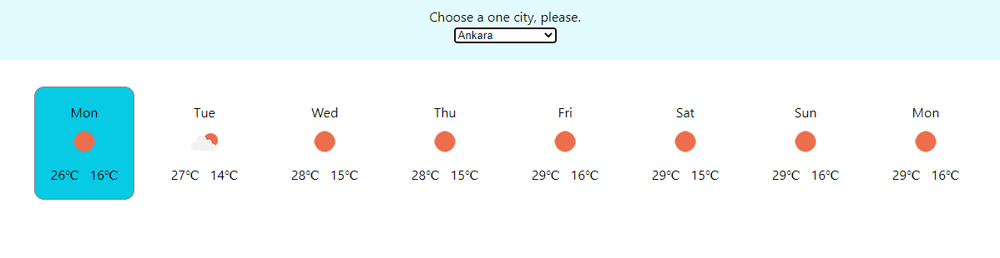
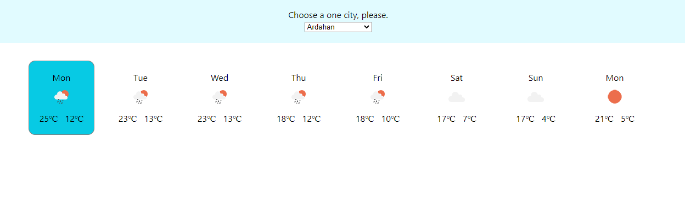

# Hava Durumu Projesi

Sizden genel olarak bir hava durumu uygulaması geliştirmeniz bekleniyor. Türkiye'nin tüm illerinin bir haftalık hava raporunu görüntüleyebilmeliyiz.

Gereksinimler
- Uygulama, Context API kullanılarak geliştirilmelidir.
- Hava raporunda görüntülenen veriler tamamen gerçeği yansıtmalıdır. Hava durum bilgilerine erişmek için OpenWeather API kullanılabilir. Veya dilediğiniz farklı bir API'ı da kullanabilirsiniz.
- Hava raporu, içinde bulunduğumuz günden başlayarak önümüzdeki bir haftalık süreci yansıtacaktır. Yukarıdaki görseli referans alabilirsiniz.
- Yukarıdaki görselde görüleceği üzere, içinde bulunduğumuz gün, bir background ve border ile belirginleştirilmelidir.
- Günlerin listelendiği kartlarda; gün adı, hava durumu görseli(güneşli, yağmurlu, karlı, parçalı bulutlu), en yüksek ve en düşük sıcaklık gösterilmelidir.
- Bir dropdown aracılığı ile farklı bir şehrin hava raporuna ulaşılabilmelidir.

=> Yaptığım projeden resimler

